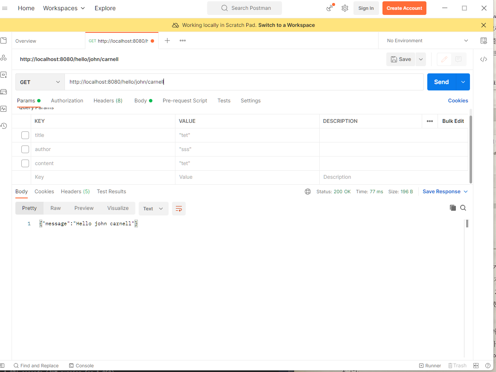

## 1.5 스프링 부트로 마이크로서비스 구축


#### 스프링 부트는 일반적인 REST 마이크서비스의 작업 (비즈니스 로직에 경로 설정 및 URL에서 HTTP 매개변수 파싱, JSON을 자바 객체로 상호 매핑)을 추상화하고 개발자가 서비스 비즈니스 로직에 집중할 수 있게 한다.

| 단계                                              | 내용                                                                                                             |
|:------------------------------------------------|:---------------------------------------------------------------------------------------------------------------|
| GET http://localhost:8080/hello/john/camell     | 클라이언트가 Hello 마이크로서비스에 HTTP GET 요청을 보낸다                                                                         |
| 경로매핑                                            | 스프링 부트는 HTTP 요청을 파싱하고 HTTP 동사 (Verb)와 URL, URL에 정의된 매개변수를 기반으로 경로를 매핑한다. 경로는 스프링 RestController 클래스의 메서드에 매핑된다 |
| 매개변수 분해                                         | 스프링 부트가 경로를 인식하면 경로 내부에 정의된 매개변수를 작업을 수행할 자바 메서드에 매핑한다                                                         |
| JSON -> 자바 객체 매핑 (Serialization)                | HTTP PUT 이나 POST는 HTTP 본문 (body) 에서 전달된 JSON을 자바 클래스에 매핑한다.                                                    |
| 비즈니스 로직 실행                                      | 모든 데이터가 매핑되면 스프링 부트는 비즈니스 로직을 실행한다                                                                             |
| 자바 -> JSON 객체 매핑                                | 비즈니스 로직이 실행되면 스프링 부트는 자바 객체를 JSON 으로 변환한다                                                                      |
| HTTP STATUS: 200 ("message":"Hello john camel") | 클라이언트는 서비스에서 JSON 으로 응답을 받는다. 호출 성공과 실패는 HTTP 상태 코드로 반환된다.                                                     |


```java
import org.springframework.boot.SpringApplication;
import org.springframework.boot.autoconfigure.SpringBootApplication;
import org.springframework.web.bind.annotation.PathVariable;
import org.springframework.web.bind.annotation.RequestMapping;
import org.springframework.web.bind.annotation.RequestMethod;
import org.springframework.web.bind.annotation.RestController;

@SpringBootApplication
@RestController
@RequestMapping(value="hello")
public class MssbSimplecloudApplication {

    public static void main(String[] args) {
        SpringApplication.run(MssbSimplecloudApplication.class, args);
    }

    @RequestMapping(value = "/{firstName}/{lastName}", method = RequestMethod.GET)
    public String hello(@PathVariable("firstName") String firstName, @PathVariable("lastName") String lastName) {
        return String.format("{\"message\":\"Hello %s %s\"}", firstName, lastName);
    }

}
```

| 키워드                    | 설명                                                    |
|:-----------------------|:------------------------------------------------------|
| @SpringBootApplication | 스프링 부트 프레임워크에 이 클래스가 스프링 부트 서비스의 진입점이라고 지정한다          |
| @RestController        | 스프링 부트에 이 클래스의 코드를 스프링 RestController 클래스로 노출하도록 지정한다 |
| @RequestMapping(value="hello") | 이 애플리케이션에서 노출된 URL은 /hello가 앞에 붙는다.                   |
|@PathVariable("firstName")| URL에 전달된 firstName 매개변수를 hello 함수에 전달하는 두 변수에 매핑한다    |
|String.format("{\"message\":\"Hello %s %s\"}", firstName, lastName)| 간단한 JSON 문자열을 직접 만들어 반환한다                             |

위의 코드에서 기본적으로 GET HTTP 엔드포인트를 하나 노출한다. URL에 2개의 매개변수를 사용해 "Hello firstName lastName"  메시지 페이로드가 포함된 JSON 스트링을 반환한다.

- 호출된 반환 값은 아래와 같다

```json
{"message":"Hello john carnell}"}
```

- 서비스 실행

터미널을 통해 다음 명령어를 입력하면 스프링 부트 플러그인을 사용해 내장된 톰캣 서버를 사용하는 애플리케이션을 시작할 수 있다.

```shell
mvn spring-boot:run
```

> 자바 vs 그루비 / 메이븐 vs 그레이들
> 스프링 부트 프레임워크는 자바와 그루비를 강력히 지원한다. 프로젝트 설정 없이 그루비를 사용해 마이크로서비스를 빌드할 수 있다.

<br/>

- 실행 결과

```shell
13:35:50.337 [Thread-0] DEBUG org.springframework.boot.devtools.restart.classloader.RestartClassLoader - Created RestartClassLoader org.springframework.boot.devtools.restart.classloader.RestartClassLoader@500c9eeb

  .   ____          _            __ _ _
 /\\ / ___'_ __ _ _(_)_ __  __ _ \ \ \ \
( ( )\___ | '_ | '_| | '_ \/ _` | \ \ \ \
 \\/  ___)| |_)| | | | | || (_| |  ) ) ) )
  '  |____| .__|_| |_|_| |_\__, | / / / /
 =========|_|==============|___/=/_/_/_/
 :: Spring Boot ::                (v2.7.3)

2022-09-16 13:35:50.629  INFO 2988 --- [  restartedMain] c.e.m.MssbSimplecloudApplication         : Starting MssbSimplecloudApplication using Java 17.0.2 on KunYoung with PID 2988 (C:\Users\ur2ku\OneDrive\바탕 화면\WORKSPACE\[Spring]workspace\mssb_simplecloud\target\classes started by ur2ku in C:\Users\ur2ku\OneDrive\바탕 화면\WORKSPACE\[Spring]workspace\mssb_simplecloud)
2022-09-16 13:35:50.630  INFO 2988 --- [  restartedMain] c.e.m.MssbSimplecloudApplication         : No active profile set, falling back to 1 default profile: "default"
2022-09-16 13:35:50.696  INFO 2988 --- [  restartedMain] .e.DevToolsPropertyDefaultsPostProcessor : Devtools property defaults active! Set 'spring.devtools.add-properties' to 'false' to disable
2022-09-16 13:35:50.697  INFO 2988 --- [  restartedMain] .e.DevToolsPropertyDefaultsPostProcessor : For additional web related logging consider setting the 'logging.level.web' property to 'DEBUG'
2022-09-16 13:35:51.316  INFO 2988 --- [  restartedMain] o.s.b.w.embedded.tomcat.TomcatWebServer  : Tomcat initialized with port(s): 8080 (http)
2022-09-16 13:35:51.322  INFO 2988 --- [  restartedMain] o.apache.catalina.core.StandardService   : Starting service [Tomcat]
2022-09-16 13:35:51.323  INFO 2988 --- [  restartedMain] org.apache.catalina.core.StandardEngine  : Starting Servlet engine: [Apache Tomcat/9.0.65]
2022-09-16 13:35:51.364  INFO 2988 --- [  restartedMain] o.a.c.c.C.[Tomcat].[localhost].[/]       : Initializing Spring embedded WebApplicationContext
2022-09-16 13:35:51.364  INFO 2988 --- [  restartedMain] w.s.c.ServletWebServerApplicationContext : Root WebApplicationContext: initialization completed in 667 ms
2022-09-16 13:35:51.590  INFO 2988 --- [  restartedMain] o.s.b.d.a.OptionalLiveReloadServer       : LiveReload server is running on port 35729
2022-09-16 13:35:51.612  INFO 2988 --- [  restartedMain] o.s.b.w.embedded.tomcat.TomcatWebServer  : Tomcat started on port(s): 8080 (http) with context path ''
2022-09-16 13:35:51.620  INFO 2988 --- [  restartedMain] c.e.m.MssbSimplecloudApplication         : Started MssbSimplecloudApplication in 1.274 seconds (JVM running for 1.959)
```

<br/>

- 서비스는 유입될 HTTP 요청에 대해 HTTP 8080 포트를 통해 수신 대기함 확인할 수 있다.
```shell
Tomcat initialized with port(s): 8080 (http)
```


<br/>

- 테스팅
테스팅을 위해 REST 도구인 POSTMAN 을 활요해 서비스를 호출해보자.
  http://localhost:8080/hello/john/carnell 엔드포인트를 호출해보면 JSON 페이로드 (``{"message":"Hello john carnell}"}``) 가 정상적으로 호출된 것을 확인할 수 있다. 





